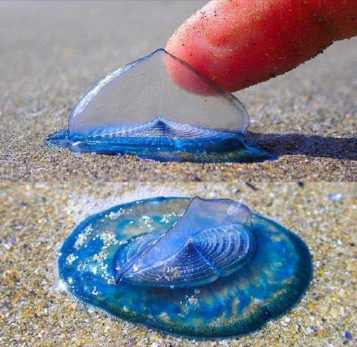

# 帆水母

|属性|说明|
| ---- | ---- |
| 别称||
| 属||
| 分布||
| 寿命||
| 外形特征| 生有扁平的充气浮囊和一根竖立在海水中的“帆”。|
| 食性||
| 习性| 喜欢群居，常结成宽达100千米的大群在海面上飘来飘去。|
| 繁殖||

参考:
- [帆水母-百度百科](https://baike.baidu.com/item/%E5%B8%86%E6%B0%B4%E6%AF%8D/2566844?fr=aladdin)
