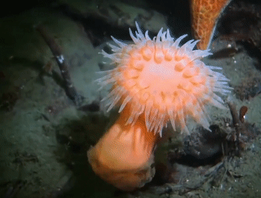
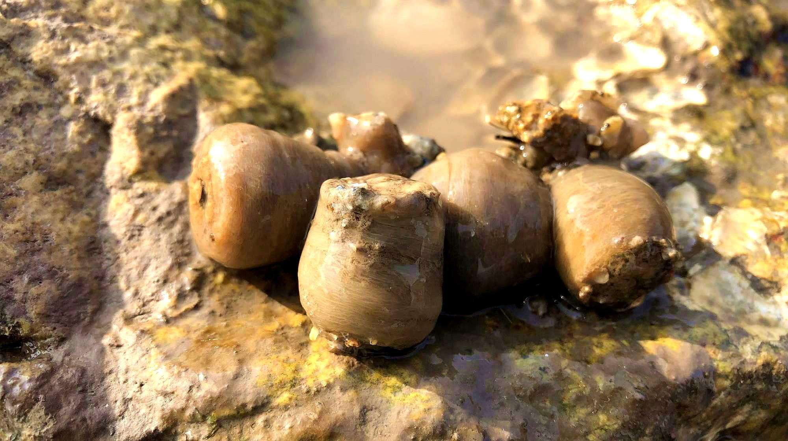

# 海葵目

海葵（学名：Actiniaria）是一种长在水里的食肉动物
- 虽然海葵看上去很像花朵，但其实是捕食性动物，它的几十条触手上都有一种特殊的刺细胞，能释放毒素。
- 多数海葵喜独居，个体相遇时也常会发生冲突甚至厮杀。
- 触手上有刺细胞，用来麻痹和捕获小鱼虾。
- 海葵的触手可以判断它接触的食物能不能吃。
- 海葵简单的神经系统能力极为有限，但却有很强的伸缩能力，口盘基部有发达的括约肌，体壁也有发达的缩肌和伸肌供柱体缩小或伸展。遇到危险时，会将身体收缩，排空触手内的水，把口盘和触手全部缩入体内。海葵在完成收缩的全部过程之前，触手是不能向外伸展的，完成这一过程需要两个半小时，并难以在两个半小时之内恢复原状。
- 多数海葵的精子和卵是在海水中受精，发育成浮浪幼虫
- 天敌有海星等

也是沿海家常菜，叫沙蒜

