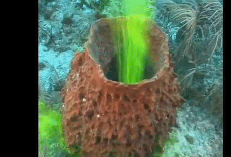

# 多孔动物门

也叫海绵动物门。

【海绵是动物】海绵缺乏神经系统、消化系统和循环系统。其构成细胞为动物细胞，且需要进行捕食来维持生理活动。

【形态】海绵动物的形状千姿百态，有片状、块状、圆球状、扇状、管状、瓶状、壶状、树枝状，姿态万般。

【捕食】海绵动物的捕食方法是用一种滤食方式，单体海绵体壁上的每一个小孔都是一张“嘴巴”。海绵动物通过不断振动体壁的鞭毛，使含有食饵的海水不断从这些小孔渗入腔内。在内壁有无数的领鞭毛细胞，由基部向顶端螺旋式地波动，从而产生同一方向的引力。当海水从体壁渗入时，水中的营养物质便被领鞭毛细胞捕捉后吞噬。经过消化吸收，从出水口排出不消化的物质。

参考:
- [海绵-百度百科](https://baike.baidu.com/item/%E6%B5%B7%E7%BB%B5/9829900?fr=ge_ala)
- [海绵滤食](https://www.bilibili.com/video/BV1ct4y1m79E/?spm_id_from=333.337.search-card.all.click&vd_source=741bff59809f9e15c309ef97c7d7c960)