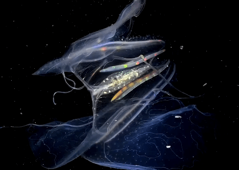

# 栉[zhì]水母动物门

刺胞动物门(水母)和栉水母动物门统称腔肠动物。

从外表来看，栉水母更像植物，如瓜、梨、球，或像一根扁平的带子，所以人们就用水果蔬菜来给它们命名，比如“海醋栗”“海核桃”“瓜水母”等。

【栉水母 vs 水母】栉水母不同于水母，它们没有毒性。而是依靠闪烁的生物电吸引黑暗中的猎物，用具有黏性的触手粘捕捉。

与收缩前进的水母不一样，栉水母有个平衡囊，可以通过平衡囊分辨出身体是上浮还是下沉，依靠大量排列成梳子状的纤毛“划水”前进。

参考:
- [黑水摄影-水下摄影师张帆-bilibili](https://www.bilibili.com/video/BV1EP4y1a7wQ/?share_source=copy_web&vd_source=fcf7bbddc2ffd7f073481728ff8f0f3c)
- [栉水母-中国海洋报](https://www.sohu.com/a/278881208_99914671)
