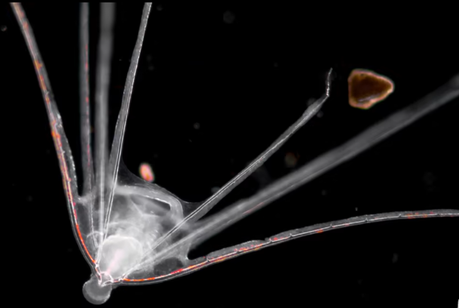
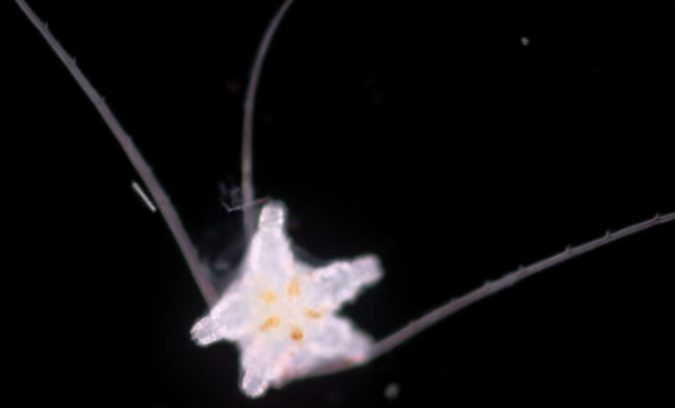
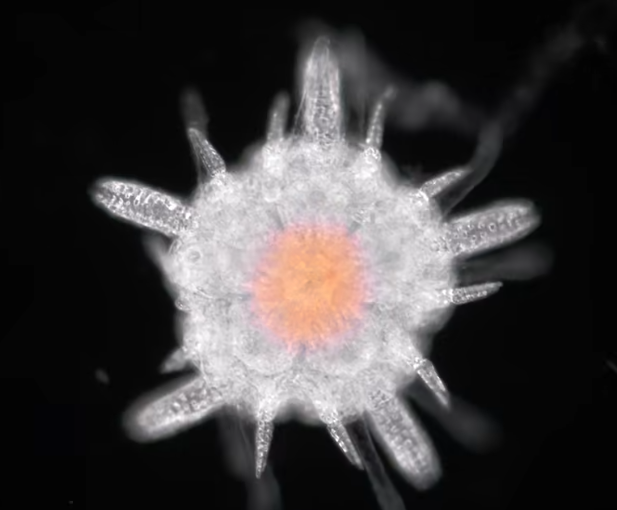
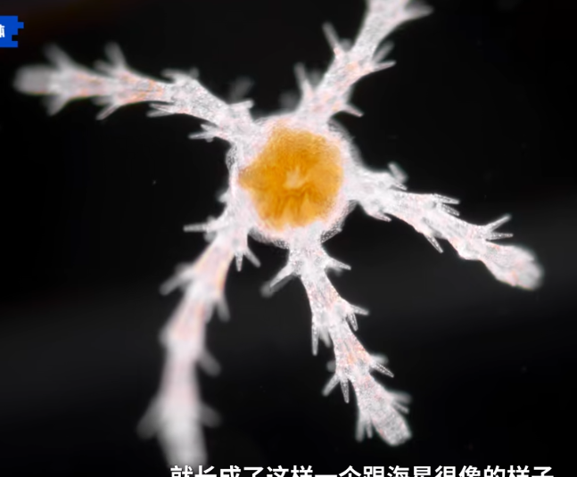
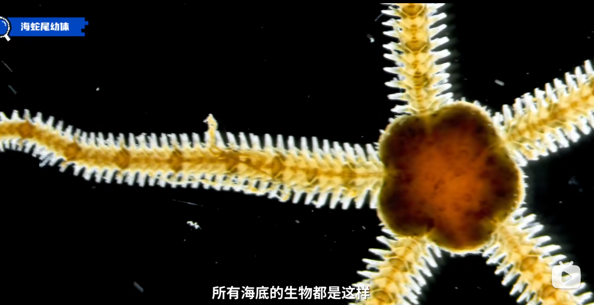

# 尾蛇纲

海蛇尾平时在海底整个身体躲起来，只露出一两条腕，没经验的人会认为是一条虫子，如果拉着往外拽，这个腕就会断掉。它的腕是由好多节构成的，跟自行车链子似得。

小时候叫长腕幼虫

幼体变化

参考:

- [bilibili-亿点点不一样](https://www.bilibili.com/video/BV18P4y1S7Qg/?spm_id_from=333.999.0.0&vd_source=741bff59809f9e15c309ef97c7d7c960)
- [亮记生物鉴定](https://www.bilibili.com/video/BV1q741167Mg/?spm_id_from=333.337.search-card.all.click&vd_source=741bff59809f9e15c309ef97c7d7c960)