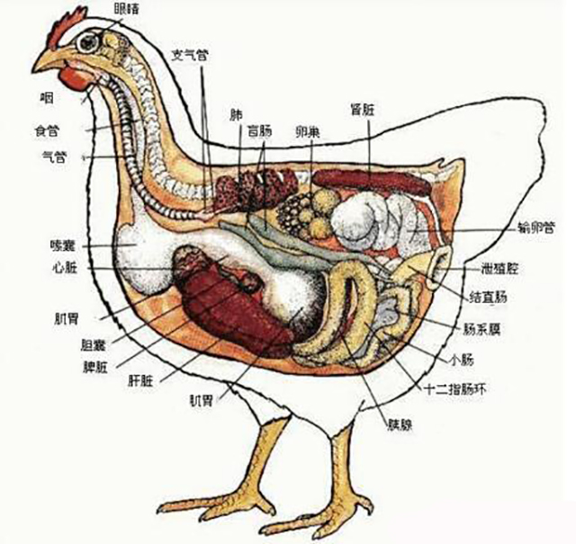

# 嗉[sù]囊

嗉囊是食道中段或后段特化形成的薄壁器官，具有良好的延展性，因此作为食物在消化前的储存场所。嗉囊在鸟类、腹足纲（如蜗牛、蛞蝓）、水蛭、昆虫、蚯蚓等动物中都可以发现。

嗉囊的机能主要有：

- 储存食物：当食物充足且胃内充满食物时，吞下的食物可贮存在嗉囊中，这样能使鸟类一次取食更多的食物。
- 消化食物：坚硬的食物要在嗉囊内经过软化膨胀的过程。嗉囊和食道内壁常具有较厚的上皮层，具有保护的作用。嗉囊内不分泌消化酶，有些唾腺丰富的雀类常在嗉囊内储存唾液以消化碳水化合物。
- 分泌嗉囊乳：鸠鸽类和某些鹦鹉的嗉囊可分泌嗉囊乳，并且雌雄都可分泌，用来哺育雏鸟。嗉囊乳是由内壁的扁平上皮急剧增殖并形成充满脂肪的非角质化细胞脱落，与半消化的食物混合而成。嗉囊乳的成分与哺乳类的乳汁成分相似，脂肪和蛋白质含量都很丰富，与哺乳类乳汁不同的是缺乏碳水化合物和钙质。

参考:
- [嗉囊-wiki](https://zh.wikipedia.org/zh-hant/%E5%97%89%E5%9B%8A)
