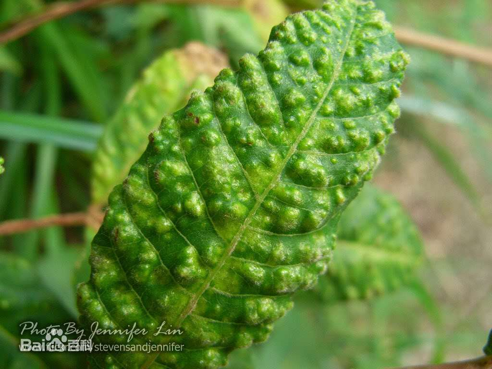

# 虫瘿

【概述】 虫瘿是植物组织遭受昆虫等生物取食或产卵刺激后，细胞加速分裂和异常分化而长成的畸形瘤状物或突起，它们是寄生生物生活的"房子"。

【形态】 虫瘿是指乔木或其他植物体上的异常发育部分或肿大部分。虫瘿可能出现在树叶、树皮、树干和树根上。通过阻断植物对水和养分的吸收，很多虫瘿能够导致植物死亡。虫瘿形状大小不等，小的和小肿块一般大小，大的比棒球还要大。虫瘿有比较硬的，也有比较软的，还有的表面呈鳞状，甚至有些还是毛茸茸的。不同虫瘿的内部组织结构有很大差异，一些呈树脂状，也有些呈软木质和革质状，还有些组织密布形同蛛网。

【造瘿昆虫】由昆虫所引起的瘿叫做虫瘿(insect gall)。可以产生虫瘿的昆虫，称做造瘿昆虫。产生虫瘿的植物，叫做成瘿植物。虫瘿通常是由幼虫或是成虫食用植物的部位，并注入化学物质、或是母虫产卵所造成的机械性刺激所引起。虫瘿产生后，幼虫就在里面发育成长，直到成熟后才离开。一般来说，昆虫必需把握植物细胞分裂最快、形成虫瘿的组织仍在发育的时期，如春天，来造瘿。虽然虫瘿可在植物的很多部位上发现，如叶片、叶柄、枝条、芽、根或花，但是造瘿昆虫非常专一，通常只在一种组织、一种植物上造瘿，最多也只在相近的植物种上造瘿。

幼虫在虫瘿中不断成长发育，与此同时，它们释放出化学物质来指导树木如何建设虫瘿，树木被欺骗了并且向虫瘿中输送养分以喂养饥饿的幼虫。科学家们称其为生理沉沦(physiologic sink)。

参考:
- [虫瘿-百度百科](https://baike.baidu.com/item/%E8%99%AB%E7%98%BF/5511445)
- [The Crazy Cribs of Parasitic Wasps-Deep Look-Youtube](https://www.youtube.com/watch?v=lOgP5NzcTuA)