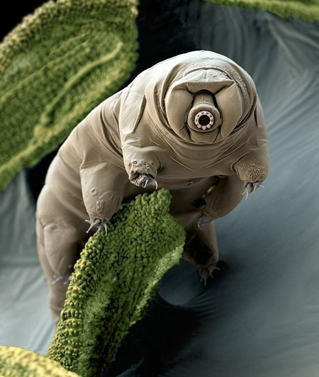

# 缓步动物门

水熊是缓步动物的俗称，主要生活在淡水的沉渣、潮湿土壤以及苔藓植物的水膜中，少数种类生活在海水的潮间带。

水熊至少在5亿年前就已存在。

它体形细小，体长0.05-1.4毫米，通体透明，足迹几乎遍布全球。一旦生存环境恶化，身体便缩成圆桶状自动脱水（隐生状态），蛰伏忍耐。德国佛莱堡大学的拉姆曾把水熊虫分别放在150℃和零下200℃（接近绝对温度）的环境中，再置于常温下，给予水分，它竟奇迹般地复活。5700戈瑞强度的放射线，原子弹的辐射杀不死它；600兆帕的压力，最深的马里亚纳海沟水压的6倍也压不扁它。一般生物缺水、缺氧基本会死亡，但它可以长时间处于一种假死状态，它们的身体会干涸，让新陈代谢停止，以此维持生机。然后遇到水，又有几率可以复活。

英国《自然》杂志上介绍说，水熊之所以能够在各种极端条件下生存，与它们身体可自动进行脱水有很大关系。科学家们发现，水熊在自行脱水后。身体体积可比正常情况下缩小一半，同时，它的八条腿也会收缩，从而进入一种静止的蛰伏状态。在这种状态下。水熊可“扛”过各种极端条件。因为水熊本身有隐生现象可以说是冬眠，不管处在什么恶劣环境下都能立刻进入冬眠，只要加一点水就能立刻复活，生命力比病毒还强，所以被称为不死身生物。

参考:

- [百度百科](https://baike.baidu.com/item/%E6%B0%B4%E7%86%8A?fromtitle=%E6%B0%B4%E7%86%8A%E8%99%AB&fromid=8145341&fromModule=lemma_search-box)
