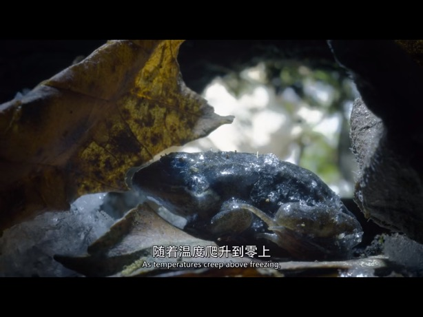

# 木蛙

木蛙有极强的抗冻能力。木蛙在冬天几乎被冻成了一块冰，心脏停止了跳动。但随着日照强度加大，木蛙开始发生神奇的变化，冻住的血液慢慢融化，并在血管中流动了起来，心脏也重新恢复了跳动。

木蛙的冰晶核蛋白限制了冰晶只在细胞外形成，避免形成大冰块损害细胞，当细胞外的水结冰，其浓度的升高使细胞内的液体外渗，细胞在安全的情况下逐渐脱水，平稳进入休眠期。

肝脏是木蛙体内最大的糖原库，阿拉斯加木蛙的肝脏重量达到了体重的百分之22。在冷冻48h内，肝脏将糖原分解为小分子的葡萄糖运输进血液。

参考: 纪录片《完美星球: 阳光》
