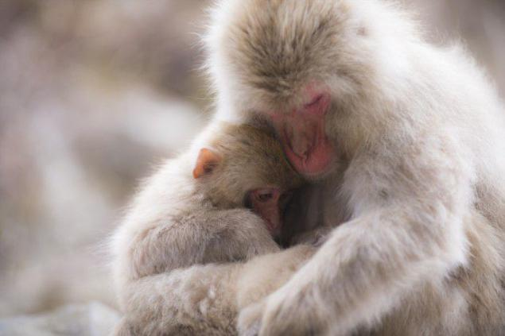
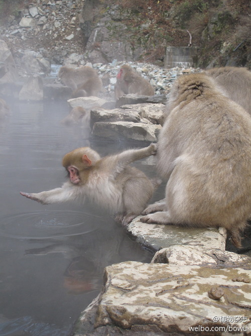

# 日本猕猴

每到冬天来临时，日本猕猴的身上就经常会披满白雪，因此这种猴子被人们称为“雪猴”，由于它们较生活在热带的同类身处更加寒冷的地方，日本猕猴进化出了集体泡温泉的习性。日本长野县著名的“雪猴泡温泉”景观。

参考： [百度百科](https://baike.baidu.com/item/%E6%97%A5%E6%9C%AC%E7%8C%95%E7%8C%B4?fromModule=lemma_search-box)