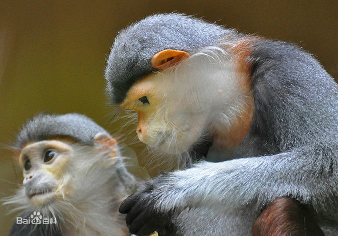

# 白臀叶猴

白臀叶猴主要栖息在热带森林，为昼行性完全树栖的猴子。以果实、种子、嫩芽和叶柄为主要食物，也吃鲜枝嫩叶、花苞、竹笋、小鸟及昆虫。

参考：[百度百科](https://baike.baidu.com/item/%E7%99%BD%E8%87%80%E5%8F%B6%E7%8C%B4%E5%B1%9E?fromtitle=%E7%99%BD%E8%87%80%E5%8F%B6%E7%8C%B4&fromid=1585358&fromModule=lemma_search-box)