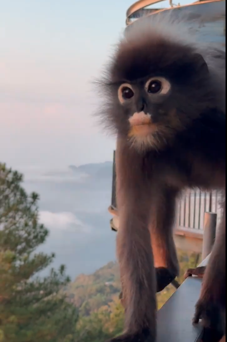
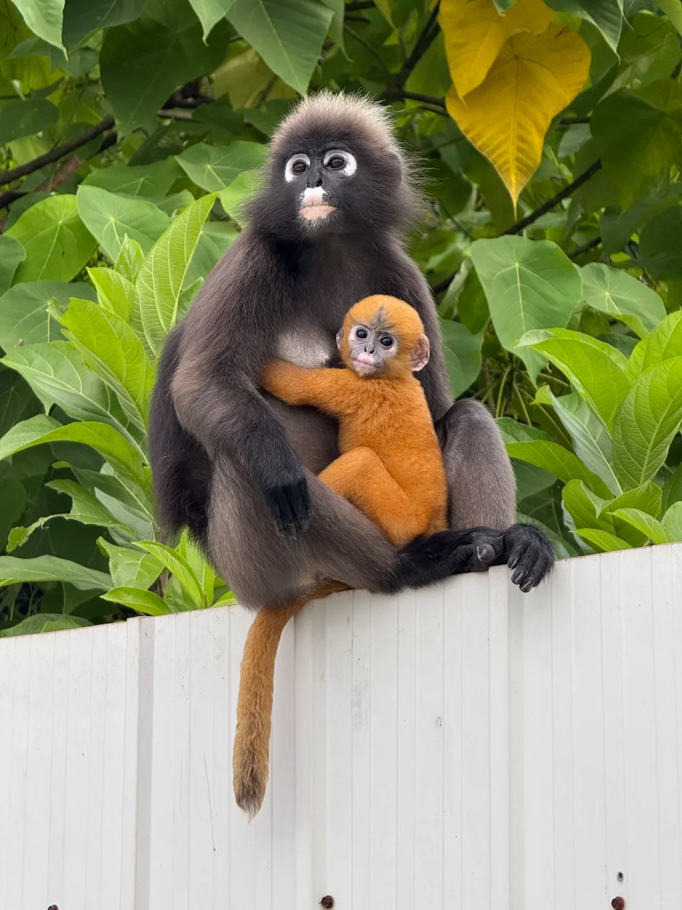

# 郁乌叶猴

|属性|说明|
| ---- | ---- |
| 别称||
| 英文名| Dusky Leaf-monkey|
| 属||
| 分布| 主要在马来半岛，包括南部的缅甸和泰国的部分|
| 寿命||
| 外形特征| 体重5-9千克，头体长42-61厘米。尾长50-85厘米，眼睛又圆又大，眼周有一圈白色，就像是戴了一副白框眼镜，亦称“眼镜叶猴”。初生的幼仔与成年猴相比，体色为桔黄色或橙色，耳、脸、手、足均为粉红色，与成体的灰黑体色形成强烈的反差，这样就会引起群体中的成员的注意，可以得到很好的保护|
| 食性||
| 习性||
| 繁殖| 幼仔通常在1月、2月和3月的月份出生，但也有记录在夏季出生。通常每窝科一个幼仔。妊娠期平均为145天。雌性的月经周期持续约三个星期，发情常伴有生殖器肿胀。正常的生育间隔约2年。|

参考:
- [郁乌叶猴-百度百科](https://baike.baidu.com/item/%E9%83%81%E4%B9%8C%E5%8F%B6%E7%8C%B4?fromModule=lemma_search-box#1)
- [嘻嘻哈哈-升旗山叶猴-小红书](https://www.xiaohongshu.com/discovery/item/67af37aa00000000280353bc?source=webshare&xhsshare=pc_web&xsec_token=ABYlauNWZaXYPq7e8VkEpkMn0FrM13SJDkQn_t4lwprgc=&xsec_source=pc_share)
- [马毅-槟城-小红书](https://www.xiaohongshu.com/discovery/item/68b6cab8000000001d028826?source=webshare&xhsshare=pc_web&xsec_token=ABrG9Wfpli9YvGu4JDnXCKYxJYQ8BMfvwDAX7oygBjA5A=&xsec_source=pc_share)