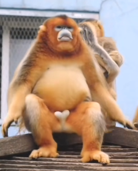
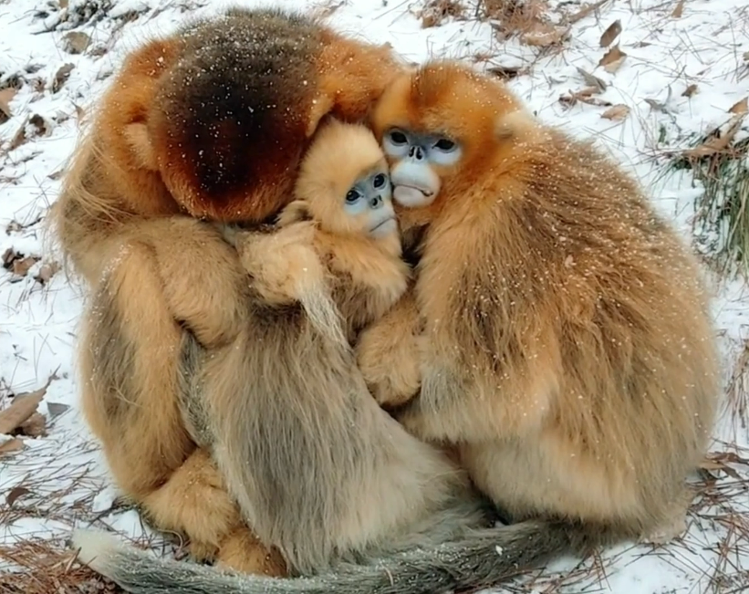

# 金丝猴

|属性|说明|
| ---- | ---- |
| 别称| 仰鼻猴|
| 属||
| 分布||
| 寿命| 十七岁左右|
| 外形特征||
| 食性||
| 习性| 群居动物，抢着带娃|
| 繁殖||

仰鼻猴属下有5种，即滇金丝猴、黔金丝猴、川金丝猴、越南金丝猴和缅甸（怒江）金丝猴。

【外形】心形蛋蛋。

【习性】会抱在一起过冬。

参考:
- 纪录片《我们诞生在中国》
- [金丝猴-百度百科](https://baike.baidu.com/item/%E9%87%91%E4%B8%9D%E7%8C%B4/37026)
