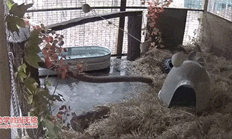

# 黑熊

|属性|说明|
| ---- | ---- |
| 别称||
| 分布||
| 寿命||
| 外形特征||
| 食性||
| 繁殖||

黑熊的嗅觉和听觉很灵敏，顺风可闻到半公里以外的气味，能听到300步以外的脚步声。但视觉差，故有“黑瞎子”之称。黑熊可以像人类一样直立行走，也能像人一样坐着，但行动谨慎又缓慢，很少攻击人类。一般在夜晚活动，白天在树洞或岩洞中睡觉。其善于攀爬，可以上到很高的树上去取果子和蜂蜜

熊孩子。