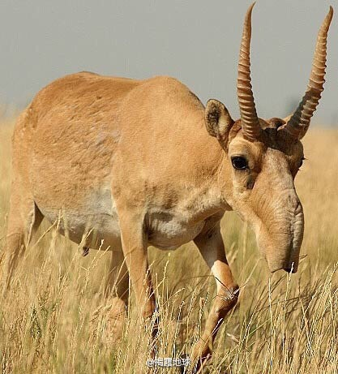

# 高鼻羚羊

|属性|说明|
| ---- | ---- |
| 别称||
| 属||
| 分布| 俄罗斯|
| 寿命||
| 外形特征||
| 食性||
| 习性| 大鼻子可以加热吸入的冷空气。|
| 繁殖||

参考：
- [高鼻羚羊-百度百科](https://baike.baidu.com/item/%E9%AB%98%E9%BC%BB%E7%BE%9A%E7%BE%8A/805779?fr=kg_general)