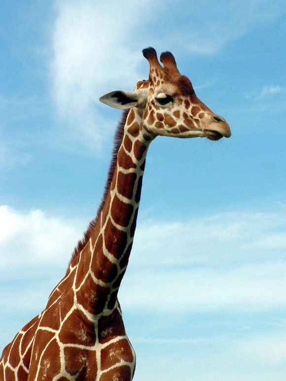
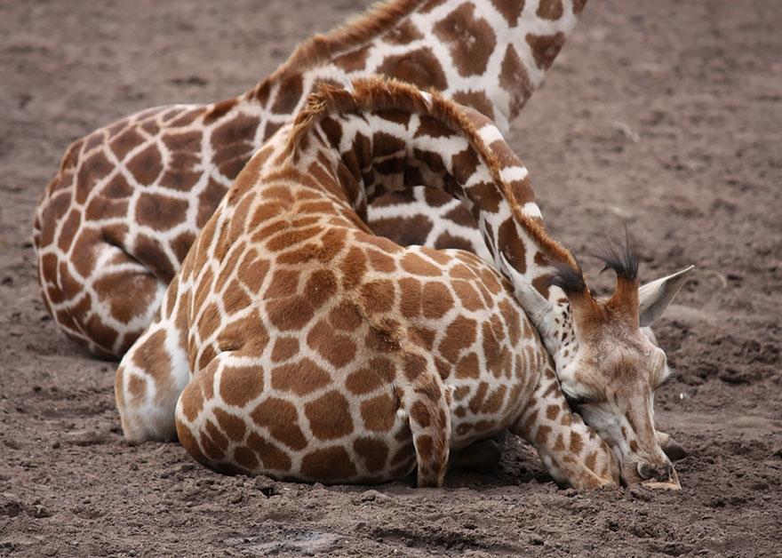

# 长颈鹿

|属性|说明|
| ---- | ---- |
| 别称||
| 分布| 非洲|
| 寿命| 27年左右|
| 外形特征||
| 食性| 主要吃各种树叶，尤喜含羞草属的树叶，一头长颈鹿每天能摄入63千克树叶和嫩枝。|
| 繁殖| 雄性长颈鹿比较“好战”，在战斗中常以 脖子为武器，这种行为被称为脖击。|

长颈鹿睡觉。不过长颈鹿躺下睡觉是一件十分危险的事情，它们更多的时候是站着睡觉。
