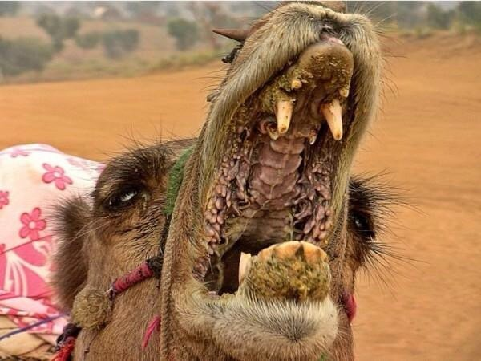

# 骆驼

|属性|说明|
| ---- | ---- |
| 别称||
| 英文名| Camel|
| 属||
| 分布||
| 寿命| 40-69年|
| 外形特征||
| 食性| 杂食|
| 习性| 耐旱|
| 繁殖||

【沙漠生存技能】
- 骆驼的驼峰并不直接储存水分，里面存储的是脂肪组织，理论上1克脂肪氧化后可以产生1克以上的水，所以骆驼不怕渴似乎是因为平时就在驼峰里存储了大量脂肪的原因；
- 骆驼长长的睫毛和流泪是为了防风沙；
- 骆驼的肾非常强大，尿液是以浓缩的汁液排出，其粪便更是干燥到可以作为引火之物，对体内的水可谓一点也不浪费；
- 骆驼的体温从晚上到白天，可以在34°C到41°C之间变化，减少出汗。

【食性】有着极其粗糙厚实和坚韧的嘴唇及口腔组织，骆驼的嘴里有角质化的乳突。让它们可以吃像仙人掌一样坚硬带刺的食物。

【防卫动作】吐口水。

【骆驼养殖】
- [吃骆驼刺](https://www.bilibili.com/video/BV1yk4y1Y74W/?share_source=copy_web&vd_source=fcf7bbddc2ffd7f073481728ff8f0f3c)
- [骆驼转场](https://www.bilibili.com/video/BV1EC2vYWEPD/?share_source=copy_web&vd_source=fcf7bbddc2ffd7f073481728ff8f0f3c)
- [骆驼采奶](https://www.bilibili.com/video/BV1Qi4y1B7pR/?share_source=copy_web&vd_source=fcf7bbddc2ffd7f073481728ff8f0f3c)
- [骆驼赛跑训练](https://www.bilibili.com/video/BV1Fs4y1w7wv/?share_source=copy_web&vd_source=fcf7bbddc2ffd7f073481728ff8f0f3c)

参考:
- [为什么骆驼能吃仙人掌-Quora](https://www.quora.com/How-are-camels-capable-of-eating-a-cactus)
- [骆驼-zhihu](https://zhuanlan.zhihu.com/p/269241019)