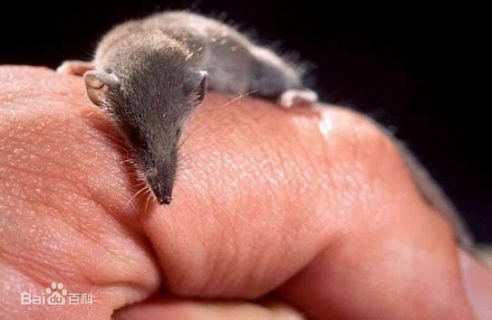
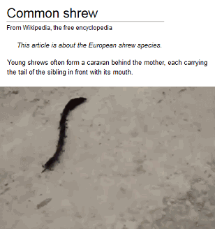

# 鼩鼱

|属性|说明|
| ---- | ---- |
| 别称||
| 属||
| 分布||
| 寿命||
| 外形特征||
| 食性||
| 习性| 鼩鼱一天到晚总是忙个不停地吃，每天至少得吞进同自己体重一样重的食物。 小鼩鼱的腭下长有唾液腺，能分泌出一种毒液。如果人去捕捉它，不小心被咬上一口，手臂就会发热肿大，引起剧痛，要过几天后才能消失。 年幼的鼩鼱会用嘴咬着前方兄弟姐妹的尾巴，一直串联到妈妈身后。|
| 繁殖||

伊特鲁里亚鼩鼱是世界上体重最小的哺乳动物。

