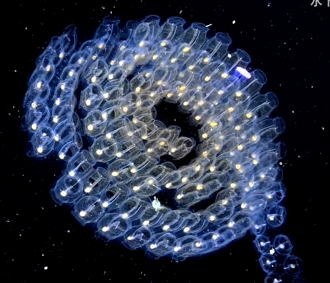

# 樽海鞘纲

【形态】樽海鞘身体呈桶状，是自由游动的被囊动物。它们被膜包裹，身体两端各有一开口，它们泵入海水，使之穿过自己胶质的身躯。樽海鞘体内有一个滤食器，它们可以边游动边摄食。

【脊椎动物】乍看起来，樽海鞘貌似水母一般原始，但它们却与脊椎动物在海洋里的祖先亲缘关系很近，有心脏和鳃孔，甚至还有原始的胎盘。

【繁殖】它们是增殖速度最快的多细胞动物，能够以爆炸般的速度无性繁殖，樽海鞘可进行同性繁殖，一个樽海鞘可以产生一系列雌雄同体克隆，并彼此相连。一些亚种的克隆链最长能达到15米。梅丁指出，樽海鞘链能呈现一定的形状，一些亚种能产生轮状，而另外一些物种能将克隆链组织成双螺旋结构。

可独居也可群居。

【群居】有些樽海鞘会连在一起形成长链，和谐群居，它们通过电信号交流，同步彼此的游泳节奏。樽海鞘可以将它克隆链上每个个体的神经元连接起来，甚至完成一些看起来很复杂的运动，实现一些奇特的造型变化，看上去像一个有意识的完整生命体一般。

【各种生物的“庇护所”】樽海鞘像是宇宙中的空间站，在它的体内住着五花八门的流浪者，在它们体内可以找到各种章鱼；也是端足类引巧贼重要的生育工具，怀孕的引巧贼会掏空一只看着顺眼的樽海鞘，在樽海鞘的空壳里产下无数的幼崽，用力推动着这个壳体让新鲜的海水不断流入自己的育婴房；樽海鞘克隆链像一条无限延展的列车一样，列车里满载着搭便车的稚鱼和头足类幼体，静默地前行着。

参考:
- [樽海鞘-planktonchronicles-bilibili](https://www.bilibili.com/video/BV1bW411r7fA/?spm_id_from=333.337.search-card.all.click&vd_source=741bff59809f9e15c309ef97c7d7c960)
- [樽海鞘-百度百科](https://baike.baidu.com/item/%E6%A8%BD%E6%B5%B7%E9%9E%98/4438570?fr=ge_ala)
- [黑水摄影-水下摄影师张帆-bilibili(17:30)](https://www.bilibili.com/video/BV1EP4y1a7wQ/?share_source=copy_web&vd_source=fcf7bbddc2ffd7f073481728ff8f0f3c)