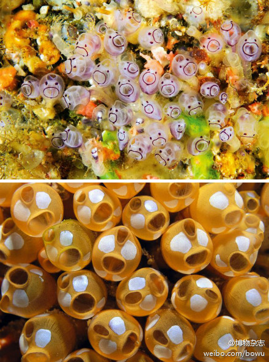

# 海鞘[qiào]纲

海鞘成体的外形像茄子或花朵，常附着在舰船底部、海底礁石上，它们长年累月固着在一个地方，一动不动，粗略一看， 根本不像动物，而像个植物。

鞘又叫“海水枪”，在它的顶部有一个小口叫“入水孔”或“呼吸孔”，不断地向里吸水，侧部还有一个口，叫“出水孔”或“泄殖孔”，不断向外排水。若用手指戳它一下，海鞘受到刺激后，小孔里能射出相当有力的水流，其形状就像用水枪向外喷水，故名“海水枪”。

既不游动，也不摄食，而是通过其出水孔和入水孔不停地吸水和排水，由鳃摄取水中的氧气，由肠道摄取其中的浮游生物和有机物来吃，从而维持生命。

大多数海鞘是雌雄同体(但异体授精)
