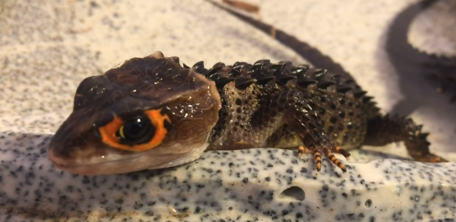

# 红眼鹰蜥

|属性|说明|
| ---- | ---- |
| 别称| 盔甲蜥|
| 属| 三棱蜥属|
| 分布||
| 寿命||
| 外形特征| 体长约15~20公分，体色为深褐色，腹面为黄褐色。这种纤细石龙子的双眼周围有橙色色块，虹膜则有一圈黄色环其头盔状的头部上有类似鸟喙的嘴巴，背上有四列突起的鳞片。|
| 食性||
| 繁殖||

参考:
- [红眼鹰蜥-百度百科](https://baike.baidu.com/item/%E7%BA%A2%E7%9C%BC%E9%B9%B0%E8%9C%A5?fromModule=lemma_search-box)
