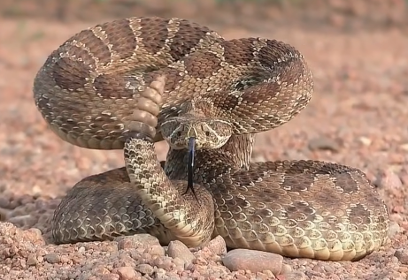
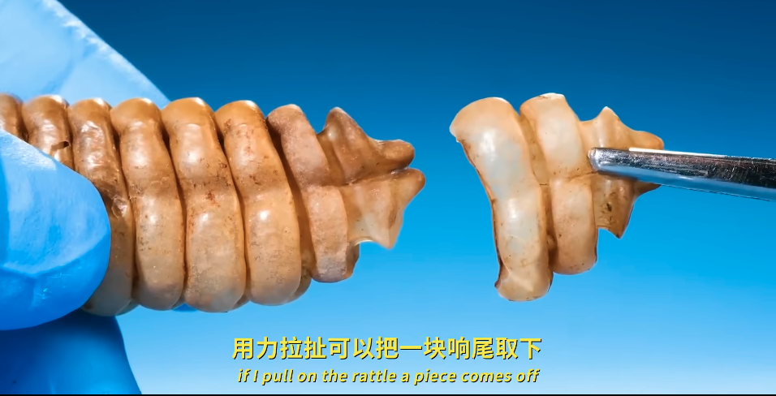
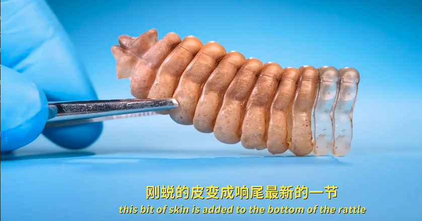
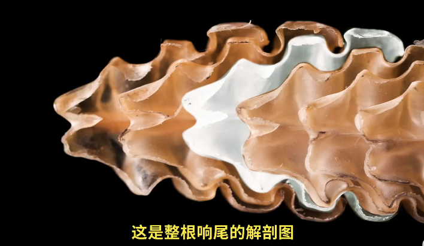

# 响尾蛇

|属性|说明|
| ---- | ---- |
| 别称||
| 英文名| Rattlesnake |
| 属||
| 分布| 美洲的干旱地区 |
| 寿命||
| 外形特征||
| 食性||
| 习性||
| 繁殖||

 响尾是空心的，可以拆成一块一块的。响尾蛇每次蜕皮，都有一小块皮留在尾巴上，刚蜕的皮变成响尾蛇最新的一节。

后一节刚好卡进前一节，它们松散地嵌合在一起，每一节都能摇摆、活动。如果晃动尾巴，它们就会相互碰撞，从而发出响尾的声音。

参考:
- [Odd Animal Specimens-youtube](https://www.bilibili.com/video/BV1dmdmYrErv/?share_source=copy_web&vd_source=fcf7bbddc2ffd7f073481728ff8f0f3c)