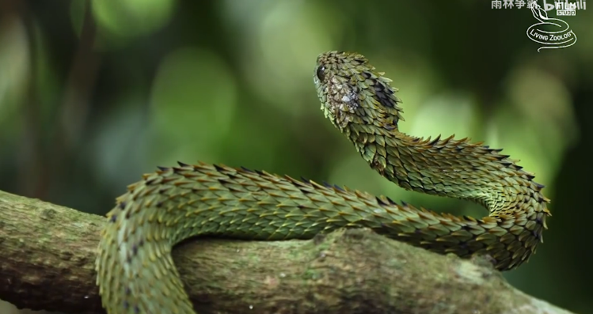
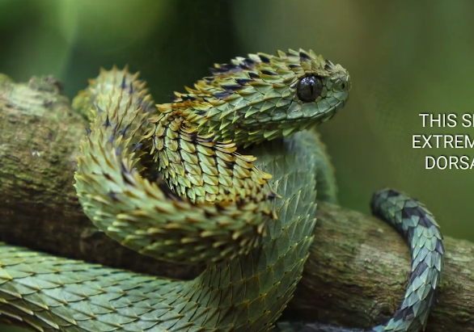
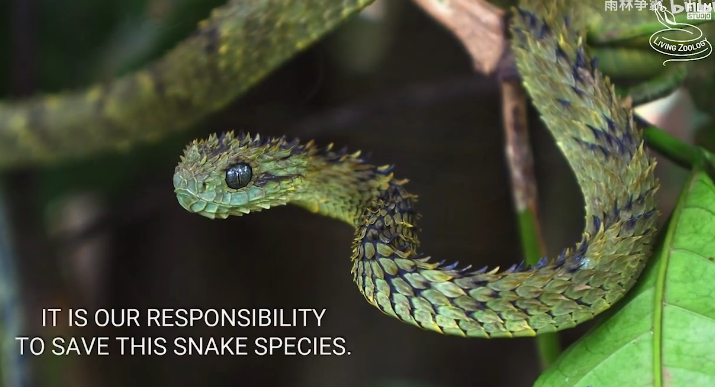
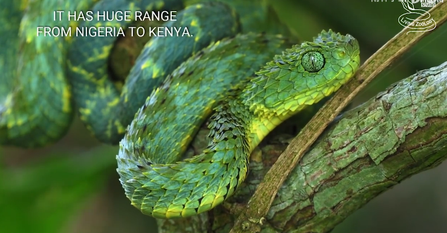

# 基伍树蝰

|属性|说明|
| ---- | ---- |
| 别称| 毛鳞树蝰|
| 属| 树蝰属|
| 分布||
| 寿命||
| 外形特征| 身体遍布著茂密尖锐的刺状鳞片。鳞片呈毛状翻起，体长大约60公分。|
| 食性||
| 繁殖| 卵胎生。|

参考:
- [毛鳞树蝮-百度百科](https://baike.baidu.com/item/%E6%AF%9B%E9%B3%9E%E6%A0%91%E8%9D%AE?fromModule=lemma_search-box)
