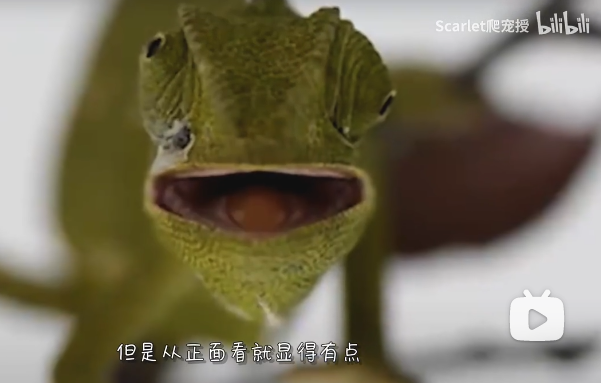
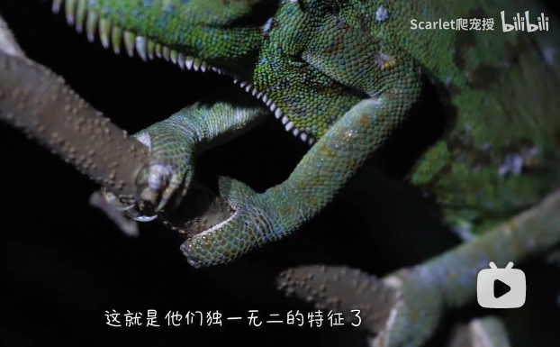
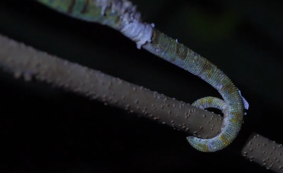

# 避役科

俗称变色龙。约有一半的种仅分布在马达加斯加，其他大部分分布在撒哈拉以南的非洲。

变色龙可以通过改变皮肤虹色细胞里的纳米晶体的排列顺序从而改变体色。变色龙变色主要都是对外界刺激的反应，高兴了伤心了冷了热了，都会在不同程度上改变体色做出反应。

变色龙的两眼珠子能够同时做到几乎180度的独立旋转，两个结合在一起就是360度无死角的视野，也让他们能够做到一只眼睛寻找猎物，另一只眼睛寻找潜在的危险。

它们的手指三两分成了两瓣确保他们可以牢牢地抓住树叶和枝干，加上被他们当成第五条腿的尾巴，可谓是完美地适应了树栖生活。

参考：

- [bilibili-Scarlet爬宠授](https://www.bilibili.com/video/BV1y54y1a7vA/?spm_id_from=333.788.recommend_more_video.5&vd_source=741bff59809f9e15c309ef97c7d7c960)
