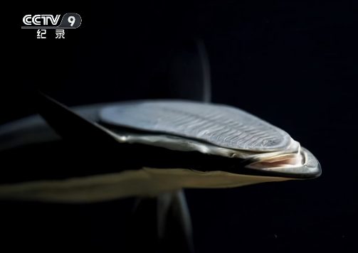
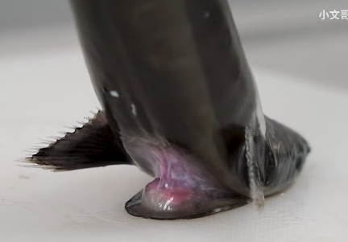

# 䲟鱼

|属性|说明|
| ---- | ---- |
| 别称| 印头鱼、吸盘鱼、粘船鱼、印鱼|
| 属||
| 分布||
| 寿命||
| 外形特征| 头顶有个鞋底一样的吸盘。|
| 食性||
| 习性||
| 繁殖||

利用头部的吸盘，䲟鱼可以吸附在鲨鱼和鳐鱼等大型鱼类的身上，轻松地获取食物。捡食大型鱼类吃剩下的食物。

䲟鱼的吸盘其实是由第一背鳍进化而来的，吸盘周围有一圈薄而有弹性的皮膜，吸盘上有很多对排列整齐的软骨板，它们能像百叶窗的板片那样竖起来，每块软骨板上都长有小刺，可以增强吸附力，当吸盘贴到大型鱼类的体表时，䲟鱼会竖起软骨板和皮膜，挤出吸盘中的水，形成真空状态，在海水压力的作用下，䲟鱼就可以牢牢吸附在大型鱼类的身体上，软骨板上的小刺可以防止它们从快速游动的鱼类身上滑下。

参考:
- 纪录片 《鱼类王国大探奇》
- [䲟鱼-小文哥吃吃吃-bilibili](https://www.bilibili.com/video/BV1sA411p7Jw/?spm_id_from=333.337.search-card.all.click&vd_source=741bff59809f9e15c309ef97c7d7c960)
