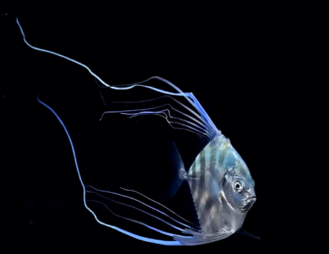

# 丝鲹

|属性|说明|
| ---- | ---- |
| 别称||
| 属||
| 分布||
| 寿命||
| 外形特征||
| 食性||
| 习性||
| 繁殖||

短吻丝鲹的幼鱼，背鳍和臀鳍的鳍条极为飘逸，随水流舞动，周身闪烁着迷幻的蓝色电光，夜幕中拖着长长的鳍条像是划过的流星。

参考:
- [黑水摄影-水下摄影师张帆-bilibili](https://www.bilibili.com/video/BV1EP4y1a7wQ/?share_source=copy_web&vd_source=fcf7bbddc2ffd7f073481728ff8f0f3c)