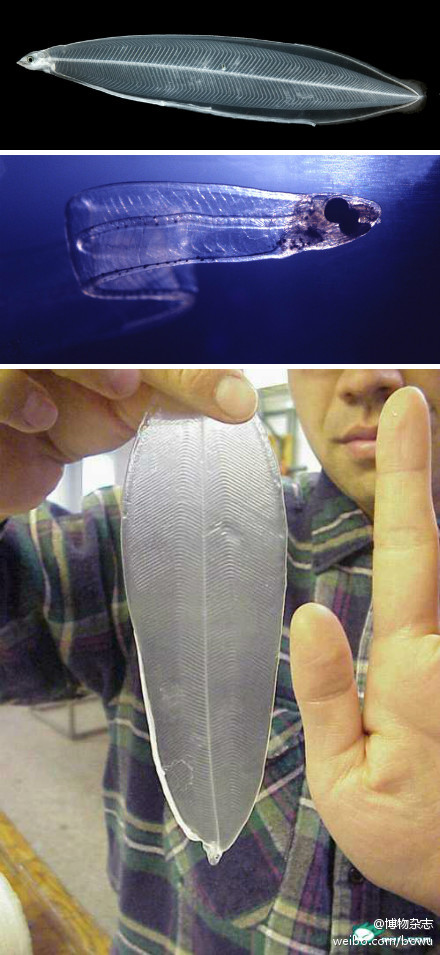

# 鳗鱼

鳗鱼在陆地的河流中生长，成熟后洄游到海洋中产卵地产卵，一生只产一次卵，产卵后就死亡。这种生活模式，与鲑鱼的溯河洄游性（Anadromous）相反，称为降河洄游性（Catadroumous）。其生活史分为6个不同的发育阶段，为了适应不同环境，不同阶段的体型及体色都有很大的改变：

- 卵期（Egg-stage）：位于深海产卵地。

- 叶鳗（Leptocephalus）：在大洋随洋流长距离漂游，此时身体扁平透明，薄如柳叶，便于随波逐流。

- 玻璃鳗（Glass eel）：在接近沿岸水域时，身体转变成流线型，减少阻力，以脱离强劲洋流。

- 鳗线（Elvers）：进入河口水域时，开始出现黑色素，却也形成养殖业鳗苗的捕捉来源。

- 黄鳗（Yellow eel）：在河流的成长期间，鱼腹部呈现黄色。

- 银鳗（Silver eel）：在成熟时，鱼身转变成类似深似深海鱼的银白色，同时眼睛变大，胸鳍加宽，以适应洄游至深海产卵。
鳗鱼的性别是环境决定的，族群数量少时，雌鱼的比例会增加，族群数量多则减少，整体比例有利于族群的增加。

## 叶鳗时期

参考: [百度百科](https://baike.baidu.com/item/%E9%B3%97%E9%B1%BC/588?fromModule=lemma_search-box)