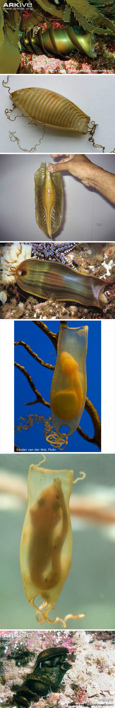

# 软骨鱼纲

内骨骼完全由软骨组成，常钙化，但无任何真骨组织；外骨骼不发达或退化，体常被盾鳞 。脑颅为原颅 ，上颌由腭方软骨 ，下颌由梅氏软骨组成。鳃孔每侧5～7个，分别开口于体外 ；或鳃孔1 对，被以皮膜。雄鱼腹鳍里侧鳍脚为交配器。肠短，具螺旋瓣。心脏动脉圆锥有数列瓣膜。无鳔。无大型耳石。泄殖腔或有或无。卵大，富于卵黄，盘状分裂，体内受精。卵生、卵胎生或胎生。

软骨鱼无鳔，用一个肥大的肝调节身体比重。

鲨鱼的卵壳奇特,一般呈扁片状或螺旋状，上面有一些附属物，能让卵附着在珊瑚或海藻上

参考: [百度百科](https://baike.baidu.com/item/%E8%BD%AF%E9%AA%A8%E9%B1%BC%E7%BA%B2?fromModule=lemma_search-box)
