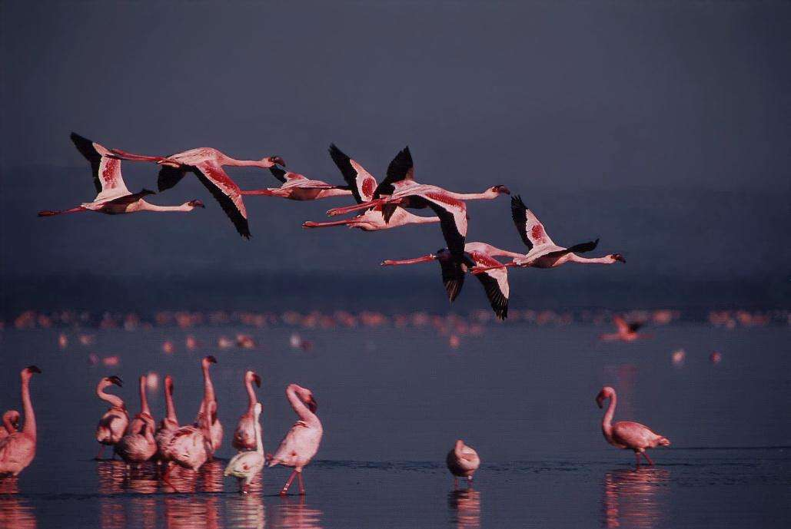

# 火烈鸟

|属性|说明|
| ---- | ---- |
| 别称||
| 属||
| 分布||
| 寿命||
| 外形特征| 羽毛主要为朱红色，特别是翅膀基部的羽毛，光泽闪亮，远远看去，就像一团熊熊燃烧的烈火，火烈鸟因此得名。但红色并不是火烈鸟本来的羽色，而是来自其摄取的浮游生物，从中获取虾青素。|
| 食性| 主要靠滤食藻类和浮游生物为生|
| 习性||
| 繁殖| 主要是“一夫一妻”制|

性怯懦，喜群栖，常万余只结群。

参考:
- [火烈鸟-百度百科](https://baike.baidu.com/item/%E7%81%AB%E7%83%88%E9%B8%9F/1042088?fromModule=lemma_sense-layer#viewPageContent)
