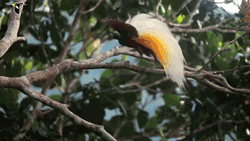
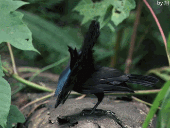

# 极乐鸟科

雄鸟求偶时抓住机会展示自己绚丽的色彩和不同寻常的装饰，并且用舞蹈、造型和其他展示动作突出自己的外表，为雌鸟以及附近的观鸟人（如果他们足够幸运的话）献上一场叹为观止的表演，可能持续数小时。

参考: [百度百科](https://baike.baidu.com/item/%E6%9E%81%E4%B9%90%E9%B8%9F%E7%A7%91/12596798?fromModule=lemma_search-box&fromtitle=%E6%9E%81%E4%B9%90%E9%B8%9F&fromid=5249)

