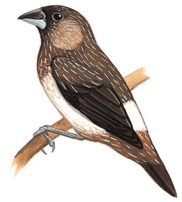

# 白腰文鸟

|属性|说明|
| ---- | ---- |
| 别称||
| 英文名||
| 属||
| 分布||
| 寿命||
| 外形特征||
| 食性||
| 习性||
| 繁殖| 繁殖高峰与稻谷成熟期重合|

参考:
- [懂鸟](https://dongniao.net/nd/9624/%E7%99%BD%E8%85%B0%E6%96%87%E9%B8%9F/White-rumped%20Munia/White-rumped%20Munia)