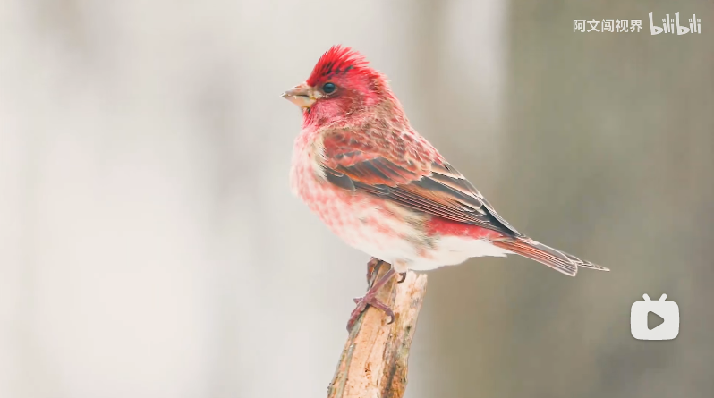

# 紫朱雀

雄性紫朱雀。

|属性|说明|
| ---- | ---- |
| 别称||
| 属||
| 分布| 分布于北美地区。|
| 寿命||
| 外形特征||
| 食性||
| 习性||
| 繁殖||

参考:
- [鸟儿-阿文闯世界-bilibili](https://www.bilibili.com/video/BV1s8411j7mw/?spm_id_from=666.25.top_right_bar_window_history.content.click&vd_source=741bff59809f9e15c309ef97c7d7c960)
