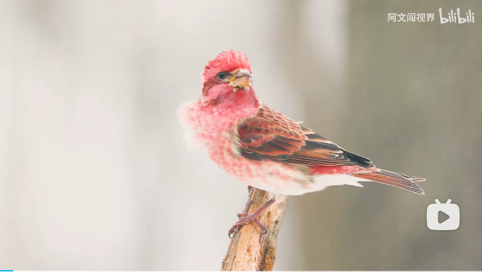

# 紫朱雀

紫朱雀，分布于北美地区。

雄性紫朱雀。

参考: [bilibili-阿文闯世界](https://www.bilibili.com/video/BV1s8411j7mw/?spm_id_from=666.25.top_right_bar_window_history.content.click&vd_source=741bff59809f9e15c309ef97c7d7c960)
