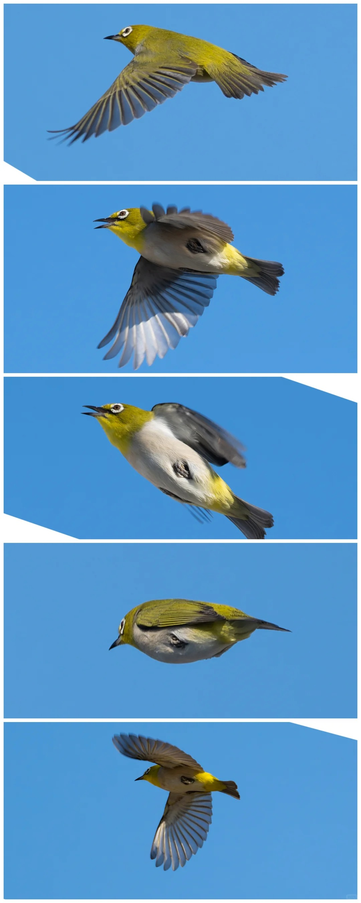

# 暗绿绣眼鸟

|属性|说明|
| ---- | ---- |
| 别称||
| 英文名||
| 属||
| 分布||
| 寿命||
| 外形特征||
| 食性||
| 习性| 常单独、成对或成小群活动，迁徙季节和冬季喜欢成群，有时集群多达50-60只。在次生林和灌丛枝叶与花丛间穿梭跳跃，或从一棵树飞到另一棵树，有时围绕着枝叶团团转或通过两翅的急速振动而悬浮于花上，活动时发出‘嗞嗞’的细弱声音。|
| 繁殖||

参考:
- [特立独行-小红书](https://www.xiaohongshu.com/discovery/item/690c75960000000004003fce?source=webshare&xhsshare=pc_web&xsec_token=ABocainq8YWwbRqn1TUd9PkLgjOmPpM0g_g9qiQ0pkUx4=&xsec_source=pc_share)
- [暗绿绣眼鸟-百度百科](https://baike.baidu.com/item/%E6%9A%97%E7%BB%BF%E7%BB%A3%E7%9C%BC%E9%B8%9F/4723427)