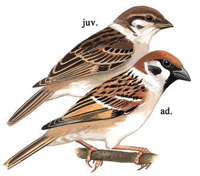
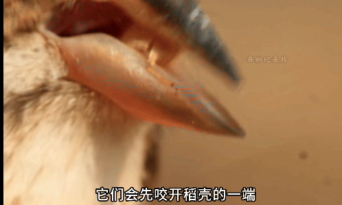

# 麻雀

|属性|说明|
| ---- | ---- |
| 别称| 树麻雀|
| 英文名| Eurasian Tree Sparrow|
| 属||
| 分布||
| 寿命||
| 外形特征| 耳后有一黑色点斑|
| 食性| 以种子为主食，也摄取昆虫，尤其在繁殖季节|
| 习性||
| 繁殖||

参考:
- [bilibili-麻雀的“剥壳术”](https://www.bilibili.com/video/BV1rpbWzdEkA/?share_source=copy_web&vd_source=fcf7bbddc2ffd7f073481728ff8f0f3c)
- [懂鸟-麻雀](https://dongniao.net/nd/9380/%E9%BA%BB%E9%9B%80/Eurasian%20Tree%20Sparrow/Eurasian%20Tree%20Sparrow)