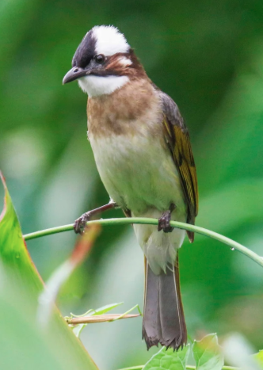
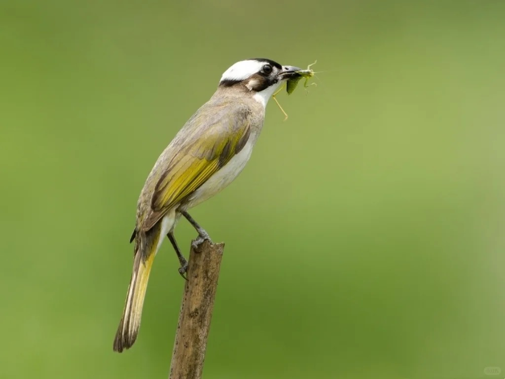

# 白头鹎

|属性|说明|
| ---- | ---- |
| 别称| 白头翁|
| 英文名||
| 属| 鹎属|
| 分布||
| 寿命||
| 外形特征| 脑袋后半截是雪白雪白的羽毛，像特意染了一头时髦的 “银发”，搭配一身橄榄绿的 “外套”|
| 食性||
| 习性||
| 繁殖||

参考:

- [区分鹎属 - 翠亨湿地马上见 - 小红书](https://www.xiaohongshu.com/discovery/item/68b10f9d000000001d002828?source=webshare&xhsshare=pc_web&xsec_token=ABVHaochFhPt_diHS30Wu6rnRYtL5uPcep0Bz4zDqmROw=&xsec_source=pc_share)
- [白头鹎 - 青鸟 - 小红书](https://www.xiaohongshu.com/discovery/item/66c5956b000000001d01be1e?source=webshare&xhsshare=pc_web&xsec_token=ABFsJSTWHPOrJ7Nk39lEwEq594kPpRextMQW9XheXb_LA=&xsec_source=pc_share)
