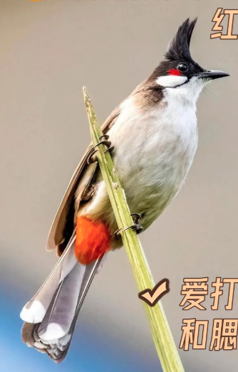

# 红耳鹎

|属性|说明|
| ---- | ---- |
| 别称||
| 英文名||
| 属| 鹎属|
| 分布||
| 寿命||
| 外形特征||
| 食性| 杂食性，但主要以植物性食物为主|
| 习性||
| 繁殖||

参考:
- [区分鹎属 - 翠亨湿地马上见 - 小红书](https://www.xiaohongshu.com/discovery/item/68b10f9d000000001d002828?source=webshare&xhsshare=pc_web&xsec_token=ABVHaochFhPt_diHS30Wu6rnRYtL5uPcep0Bz4zDqmROw=&xsec_source=pc_share)