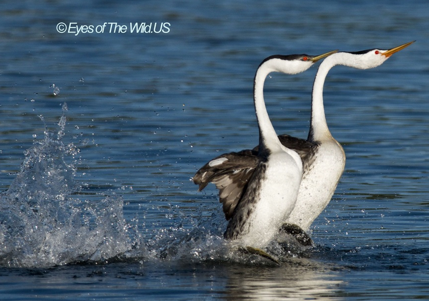

# 克式䴙䴘

|属性|说明|
| ---- | ---- |
| 别称||
| 英文名| Clark's Grebe|
| 属||
| 分布| 美洲。栖息于淡水湖泊|
| 寿命||
| 外形特征| 两脚位近臀部|
| 食性||
| 习性| 不善飞翔，能潜水觅食|
| 繁殖||

【求偶】 [克式䴙䴘求偶舞蹈](https://www.bbc.co.uk/programmes/p02bn5b9) The female tests her partner's continuing commitment by inviting him to join her in a beautiful and ritualised dance. The grebes swim side by side, bobbing dipping their heads in unison and grooming their feathers. To strengthen their bond he offers her a gift of freshly caught fish. With eyes only for one another the faithful pair reach the climax of their dance. Lowering their heads in preparation they paddle their feet to lift themselves out of he water and dance along the surface together.

水上奔跑的速度可以达到四十公里每小时。

参考:
- 懂鸟-微信小程序
- [Partners for life-BBC(2009)]
