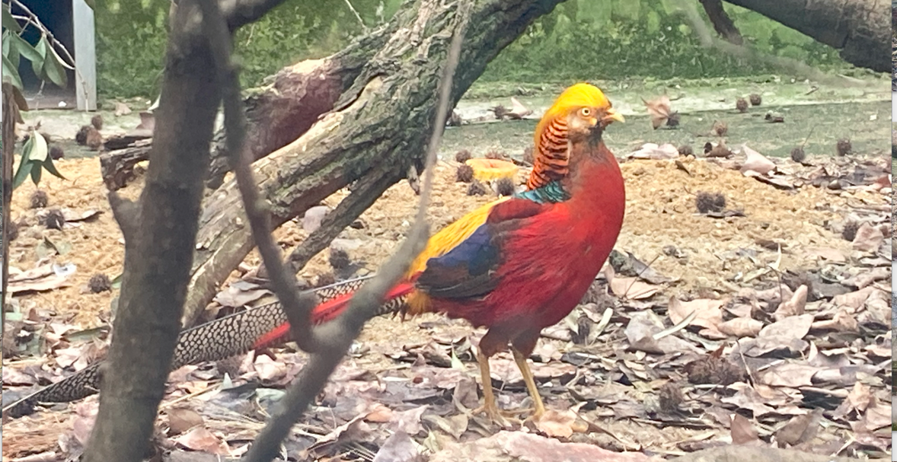

# 红腹锦鸡

|属性|说明|
| ---- | ---- |
| 别称||
| 属||
| 分布| 主要分布于青海、甘肃、陕西、四川、贵州、云南、湖北、湖南、广西等地。栖息于海拔500—2500米的阔叶林、针阔叶混交林和林缘疏林灌丛地带，也出现于岩石陡坡的矮树丛和竹丛地带，冬季也常到林缘草坡、耕地活动和觅食。|
| 寿命||
| 外形特征||
| 食性||
| 习性||
| 繁殖||

参考:
- [雪中飞舞-cappi指尖上的风景-bilibili](https://www.bilibili.com/video/BV1Z5411B7v5/?share_source=copy_web&vd_source=fcf7bbddc2ffd7f073481728ff8f0f3c)
- [红腹锦鸡-百度百科](https://baike.baidu.com/item/%E7%BA%A2%E8%85%B9%E9%94%A6%E9%B8%A1/351840?fr=ge_ala)