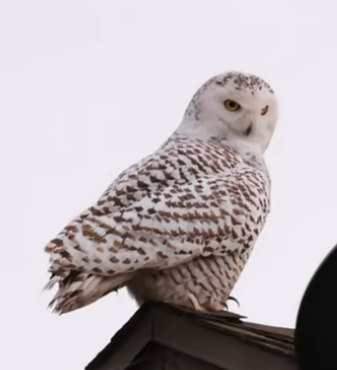

# 雪鸮

|属性|说明|
| ---- | ---- |
| 别称| 雪枭，哈利波特的猫头鹰|
| 分布| 高纬度和高海拔的寒冷地区。|
| 寿命||
| 外形特征||
| 食性| 主要以北极地区常见的小型哺乳动物为食，主要包括旅鼠和幼岩雷鸟，食物匮乏时也会游荡到其他地域取食其他啮齿类动物、雉类、雁鸭类和雪兔等。不能被砂囊吸收或被排泄的东西以食丸的形式反吐出来。|
| 繁殖| 雪鸮终身为一夫一妻制，不过当食物极度充足时也可能有一夫多妻制的情况。|

参考:
- [百度百科-雪鸮](https://baike.baidu.com/link?url=bDYGmbrNcebAOP6OlZLVAK0ISKg-a5NDdK8SWQr0JCrKtiN7lg6uyQPl9xChKI3gXC7Tr0wz9EJ2olPyY1sIcUV7DcqMbVF5BUGJUhxEP7K)
- [bilibili-梦失焦的石榴](https://www.bilibili.com/video/BV1b24y1v7mC/?spm_id_from=333.999.0.0&vd_source=741bff59809f9e15c309ef97c7d7c960)
