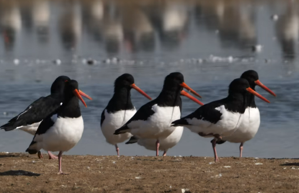
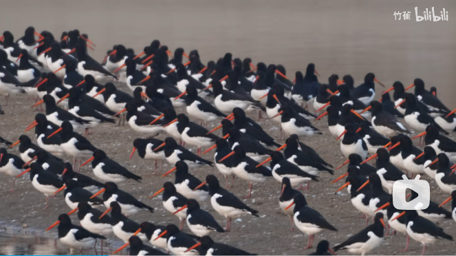
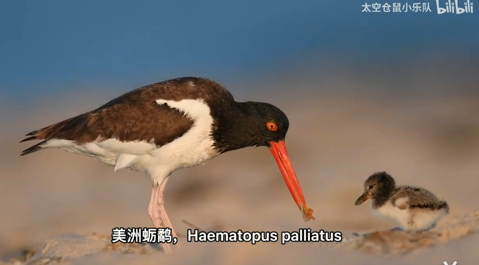

# 蛎[lì]鹬[yù]

|属性|说明|
| ---- | ---- |
| 别称||
| 属||
| 分布||
| 寿命||
| 外形特征| 嘴形特别，较长而强，适于开启坚硬的贝壳（牡蛎等）。嘴通常是红色或桔红色。鼻孔线状。脚粉红色，足仅具前三趾。|
| 食性||
| 习性||
| 繁殖||

参考:
- [胡萝卜嘴怪鸟-竹雀-bilibili](https://www.bilibili.com/video/BV1uG4y1T7eC/?spm_id_from=333.999.0.0&vd_source=741bff59809f9e15c309ef97c7d7c960)
- [Oystercatcher cracking mussel-youtube](https://www.youtube.com/watch?v=JRZDznBNJLI)