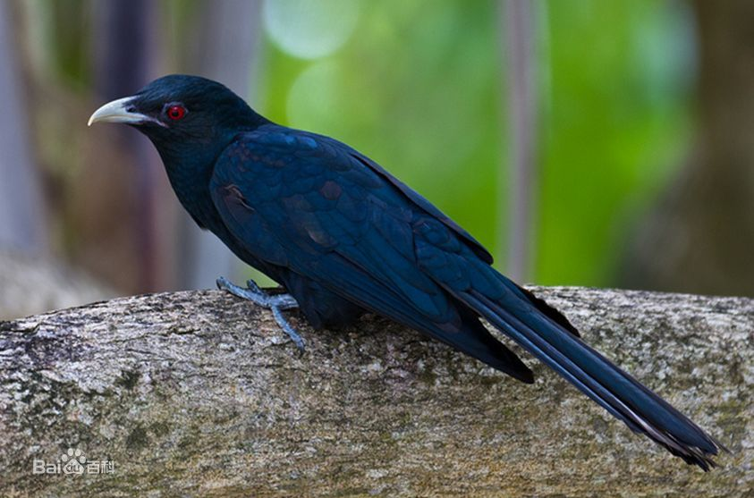
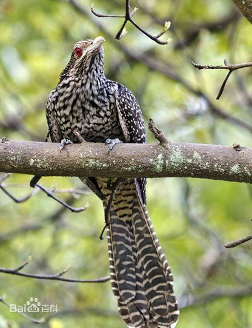

# 噪鹃

雄性。

雌性。

|属性|说明|
| ---- | ---- |
| 别称||
| 属||
| 分布||
| 寿命||
| 外形特征||
| 食性||
| 习性| 日夜发出嘹亮的声音，雄鸟“喔哦”声，重音在第二音节，重复多达12次，音速音高渐增。|
| 繁殖| 巢寄生。|

参考:
- [噪鹃-百度百科](https://baike.baidu.com/item/%E5%99%AA%E9%B9%83/610383?fr=aladdin)
