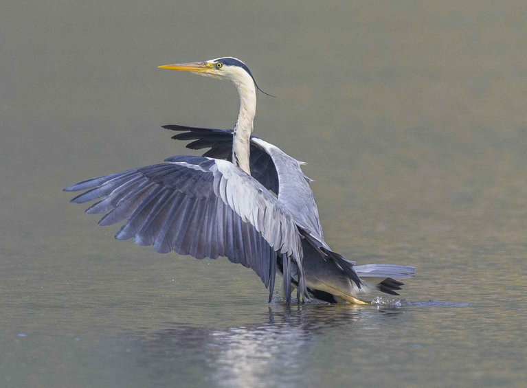

# 苍鹭

|属性|说明|
| ---- | ---- |
| 别称| 长脖老等，灰鹳，青庄|
| 属||
| 分布| 欧亚，非洲|
| 寿命||
| 外形特征| 成鸟：过眼纹及冠羽黑色，4根细长的羽冠分为两条位于头顶和枕部两侧，状若辫子。|
| 食性||
| 习性| 性情寂静而有耐力，行动极为灵活敏捷，有时站在一个地方等候食物长达数小时之久，所以被叫做“长脖老等”|
| 繁殖||

参考:
- [苍鹭起飞降落-狼行天下-鸟网](https://www.birdnet.cn/thread-810547-1-1.html)
- 懂鸟-微信小程序
