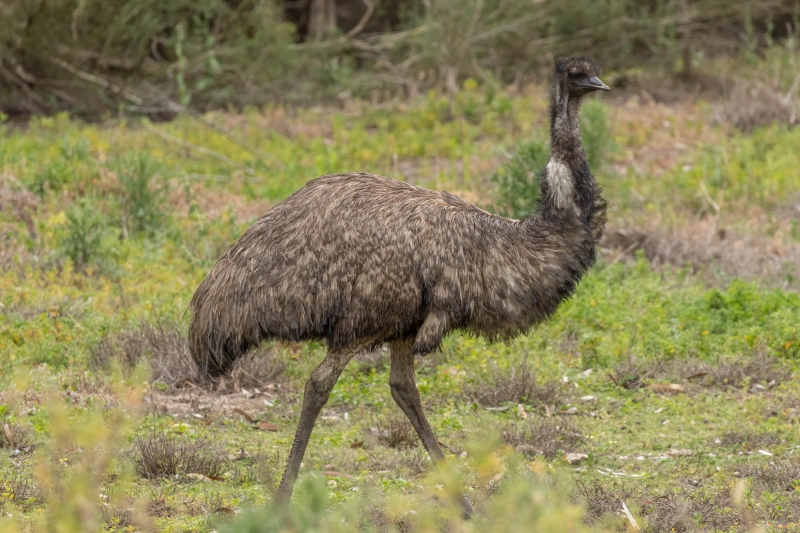
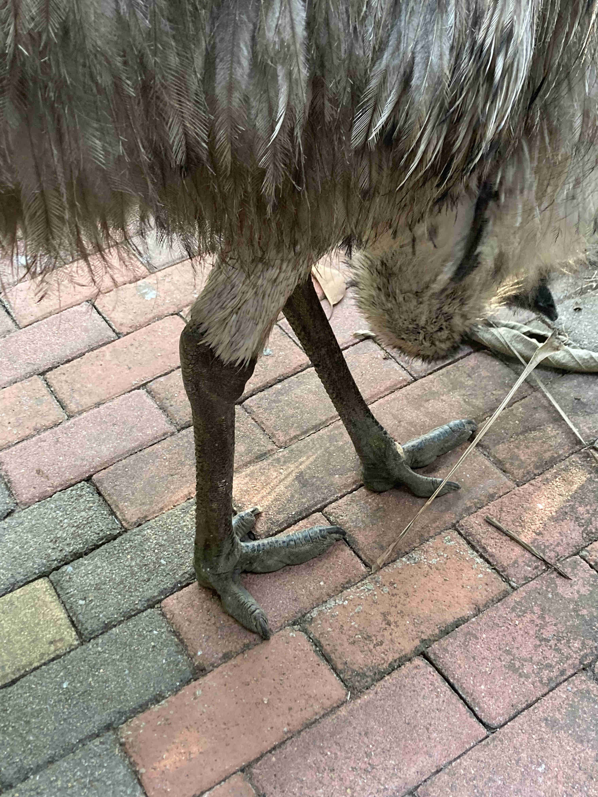

# 鸸鹋

|属性|说明|
| ---- | ---- |
| 别称||
| 英文名| Emu|
| 属||
| 分布| 澳大利亚|
| 寿命||
| 外形特征| 高度可达1.5至1.9米, 仅次于非洲鸵鸟|
| 食性| 杂食性动物，以野草、种子、果实和小型动物为食。|
| 习性||
| 繁殖| 在夏季配对，雄鸟负责筑巢和孵化深绿色的大型蛋。雌鸟每隔一两天与雄鸟交配，每次产下5至15枚蛋。雄鸟在孵化期间几乎不吃不喝，完全依靠消耗体内脂肪维生。孵化期约为8周，之后由雄鸟照顾幼鸟长达两个月，直到它们完全长大。|

参考:
- [鸸鹋-懂鸟]
