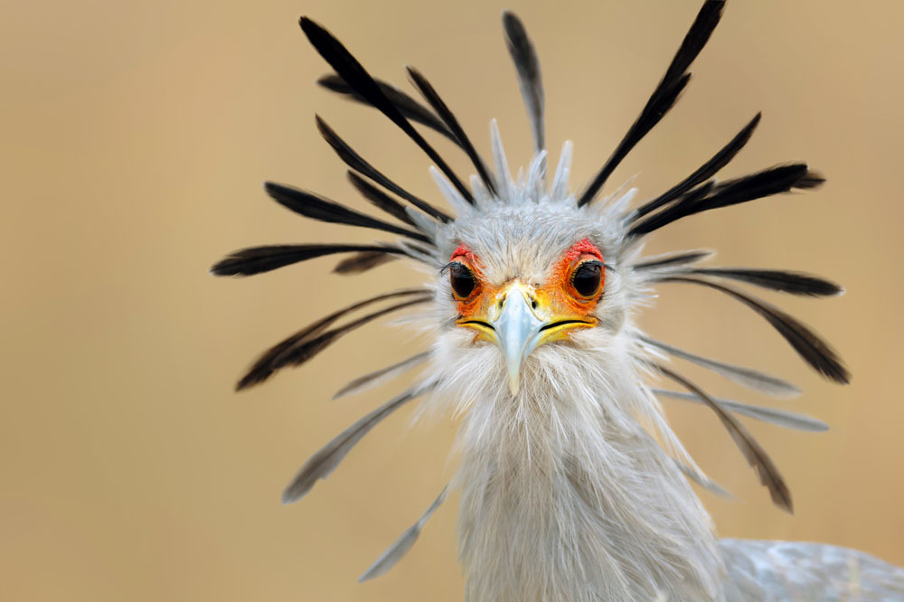
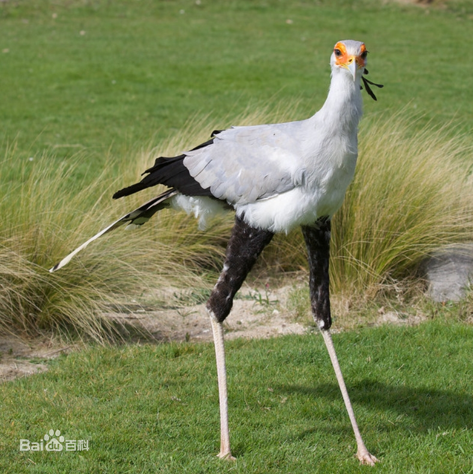

# 蛇鹫

|属性|说明|
| ---- | ---- |
| 别称| 秘书鸟|
| 分布| 非洲|
| 寿命||
| 外形特征||
| 食性| 食物主要为大型昆虫和小型哺乳动物，主要是啮齿动物，包括野兔、猫鼬、老鼠、松鼠、蛇、蜥蜴类、两栖类、淡水蟹类和鸟类以及它们的卵。[蛇鹫捕食蛇](https://www.bilibili.com/video/BV1K64y1y7Zs/?spm_id_from=333.337.search-card.all.click&vd_source=741bff59809f9e15c309ef97c7d7c960)|
| 繁殖| 一夫一妻制，配对后到死亡很少分开|

