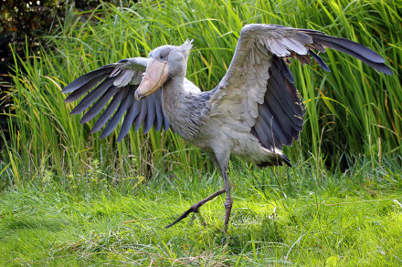
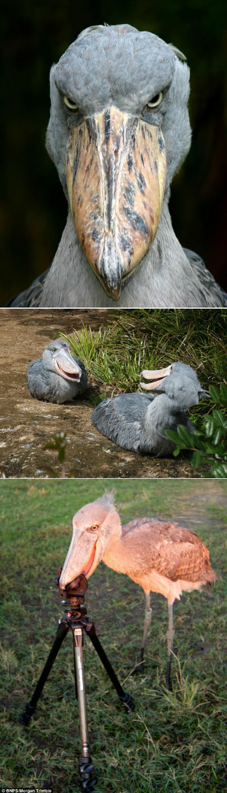

# 鲸头鹳

|属性|说明|
| ---- | ---- |
| 别称||
| 分布| 非洲东部热带地区苏丹共和国和赞比亚的巨大沼泽地区。|
| 寿命||
| 外形特征| 鲸头鹳喙宽大而粗壮，身长可达150厘米，成年鸟羽主要为灰色，幼鸟的羽毛主要为棕色。|
| 食性| 在泥水中捕鱼，其食物主要是肺鱼类。|
| 繁殖| 巢筑在地面上，每次产两枚卵。|

名称来自于它强大的喙。

参考: [百度百科](https://baike.baidu.com/item/%E9%B2%B8%E5%A4%B4%E9%B9%B3?fromModule=lemma_search-box)