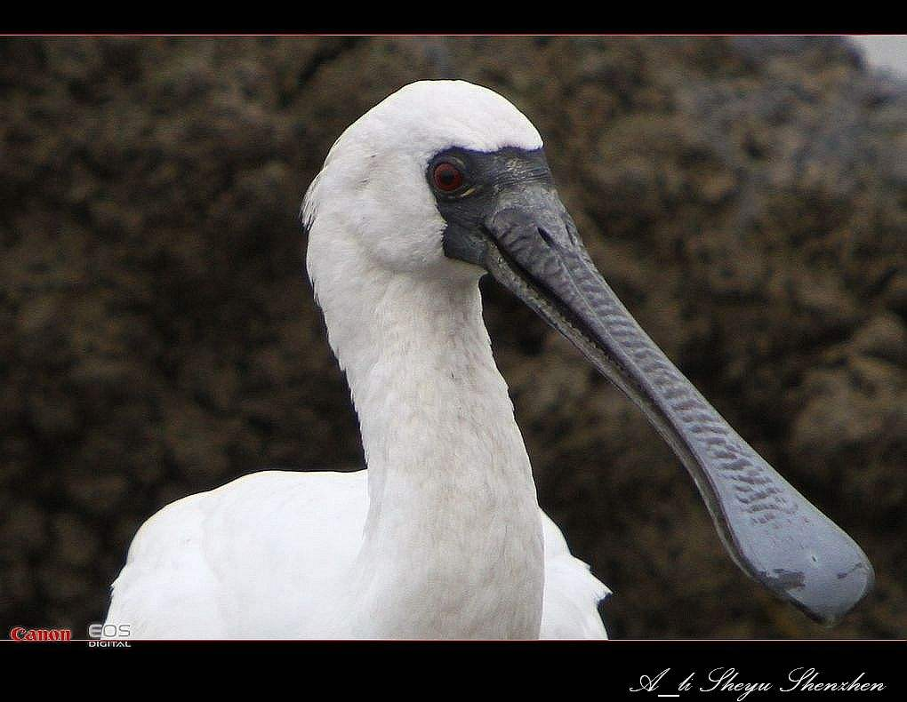

# 黑脸琵鹭

黑脸琵鹭因其扁平如汤匙状的长嘴，与中国乐器中的琵琶极为相似而得名。觅食活动主要在白天，多在水边浅水处觅食。觅食的方法通常是用小铲子一样的长喙插进水中，半张着嘴，在浅水一边中涉水前进一边左右晃动头部扫荡，通过触觉捕捉到水底层的鱼、虾、蟹、软体动物、水生昆虫和水生植物等各种生物，捕到后就把长喙提到水面外边，将食物吞吃。

参考：[百度百科](https://baike.baidu.com/item/%E9%BB%91%E8%84%B8%E7%90%B5%E9%B9%AD/347612?fromModule=lemma_search-box)
