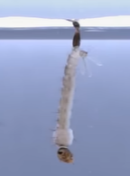
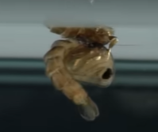
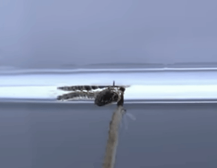

# 蚊科

【完全变态】蚊的发育为完全变态，生活史分四个时期，即卵、幼虫、蛹和成虫。前三个时期生活于水中，成虫生活于陆地。蚊的发育为完全变态，生活史分四个时期，即卵、幼虫(孑孓[jié jué])、蛹和成虫。前三个时期生活于水中，成虫生活于陆地。

在水下，孑孓为了避免成为鱼儿的美餐，动作无比灵活。“屁股”上长着呼吸管。

蛹，外形长得像逗号，也会在水里蹦蹦跳跳，还能够依靠脑袋上的一对触角一样的东西来呼吸空气。

羽化。

【交配】雌蚊一生只交配一次，交配后由雄性副腺分泌的液体，形成交配栓于雌性交配孔内，但逐渐溶解，约于24小时后完全消失。一生只交配一次，后其一生（100多天后）产下的卵尚可受精。

参考:
- [蚊科-百度百科](https://baike.baidu.com/item/%E5%AD%91%E5%AD%93/478594?fr=aladdin)
- [孑孓-小阳的昆虫世界-bilibili](https://www.bilibili.com/video/BV1vc411u7EV/?spm_id_from=333.880.my_history.page.click&vd_source=741bff59809f9e15c309ef97c7d7c960)