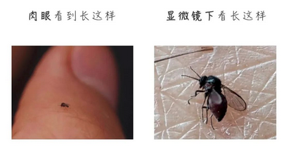

# 库蠓

|属性|说明|
| ---- | ---- |
| 别称| 小咬|
| 英文名| Culicoides， no-see-ums（看不到它们）|
| 属||
| 分布||
| 寿命||
| 外形特征| 体格比蚊子咬，在2mm左右|
| 食性||
| 习性| 飞行能力弱|
| 繁殖||

参考:
- [库蠓-wiki](https://zh.wikipedia.org/wiki/%E5%BA%93%E8%A0%93%E5%B1%9E)
- [蠓虫-卫建委]