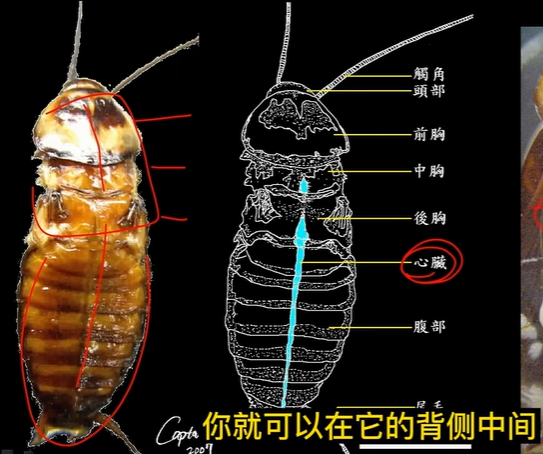
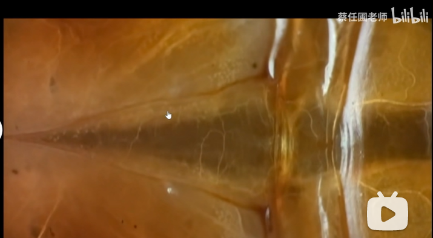

# 昆虫纲

【循环系统】昆虫的循环系统为开管式循环系统，所有的器官全部浸泡在体液之中。它们有心脏和一些其他辅助机构来让体液按照确定的方向流动，把养分送入各气管内。血液的压力较低，当附肢受伤折断时，创口很快就会被封住，不至于大量失血致死。

与人类的心脏不同，昆虫的心脏是一条管状结构，有好几节，每一节都同步收缩，下图蓝色的为蟑螂的心脏。

下图为蟑螂后胸的那一节心脏，也成为T3心脏，是蟑螂体内最大的一节心脏。和人一样，当蟑螂体温增加或是在运动的时候，它的心脏也会加快。上面细细的白色的管子是昆虫的气管。

昆虫没有淋巴系统，它的血液又叫“血淋巴”，即兼顾血液和淋巴液的作用。

【呼吸系统】昆虫的气管全身组织都有，连昆虫的心脏壁上也会粘着这些气管。昆虫有着独特的“气门”来进行气体交换，一般分布在腹部和胸部。

【神经系统】一般是头胸腹三个部分有神经节点，，是处理感觉信息的神经元簇，每一个都是一个“脑”，因此不论你横切或者只切掉头部它的神经系统都可以保证工作。

参考:
- [昆虫循环系统-Cascade-zhihu](https://www.zhihu.com/question/21271105/answer/17717947)
- [蟑螂的心电图-蔡任圃老师-bilibili](https://www.bilibili.com/video/BV11U4y1P7wS/?spm_id_from=333.337.search-card.all.click&vd_source=741bff59809f9e15c309ef97c7d7c960)
- [蟑螂无头也可以生存一段时间-夏二楞-zhihu](https://www.zhihu.com/question/20563268)
